# Humedad_de_suelo

<h1>Introducción al uso de imágenes de Radar de Apertura Sintética aplicado a la agricultura</h1> 
<h2>Manual de cálculo de humedad de suelo</h2> 

Este manual fue elaborado por la Escuela de Geografía de la Universidad de Costa Rica, para el cual colaboraron Emmanuel Jesús Céspedes-Rivera y Cristian Aguilar-Barboza en calidad de asistentes avanzados del proyecto "Transformación digital: Incorporación de tecnología SAR en la gestión de riesgos, agricultura y recursos naturales para Centroamérica", en el marco del proyecto UCREA-IICA.

Este proyecto está coordinado por el Dr Edgar Espinoza Cisneros y co-cordinado por MSc María José Molina Montero. Para mayor información contactar a maria.molinamontero@ucr.ac.cr .

Índice
 

<li><a href="#Sección1">1. Prerrequisitos</a></li>
<li><a href="#Sección2">2. Introducción</a></li>
<li><a href="#Sección3">3. Procesamiento y análisis</a></li>
<li><a href="#Sección4">4. Librería Soil Moisture</a></li>
<li><a href="#Sección5">5. Estimación Humedad de suelo</a></li>
<li><a href="#Sección6">6. Recomendaciones</a></li>
<li><a href="#Sección7">7. Bibliografía</a></li>
 

<h2 id="Sección1">1. Prerrequisitos</h2>

Para ejecutar esta rutina el usuario debe instalar previamente el software Sentinel Toolbox (SNAP), el cual es un software de procesamiento para el análisis y observación de la tierra, con herramientas enfocadas en extensibilidad de datos, portabilidad, procesamiento en marcos gráficos, entre otras herramientas (ESA, 2020).

<h4 id="Sección3">Fig. 1. Sentinel Toolbox (SNAP).</h4>

La descarga del software SNAP se puede realizar en la siguiente dirección electrónica
 

<a href="http://step.esa.int/main/download/snap-download/" target="_blank">http://step.esa.int/main/download/snap-download/</a>
 

Los requisitos computacionales mínimos son:
<li>Sistema operativo: Linux, Mac, Windows.</li>
<li>RAM: 8 GB Procesador Intel® Core™ i5-5 o sus equivalentes.</li>
<li>Espacio en disco mínimo 5GB</li>

<h2 id="Sección2">2. Introducción</h2>

La humedad del suelo es un parámetro clave en la regulación del ciclo del agua en la tierra, ya que está en función de las tasas de evaporación y precipitación sobre el suelo, por lo tanto, la disponibilidad de agua en el suelo es esencial para estudios en agricultura, hidrología, meteorología, entre otras (Alexakis et al., 2017). Las imágenes Radar de Apertura Sintética (SAR por sus siglas en inglés) de Sentinel-1, tienen el potencial de estimar de forma indirecta la humedad de suelo debido a características de resolución espacial, temporal y polarización.

La detección remota con sensores ópticos requieren de observaciones con productos de buena calidad, libre de nubes o sombras de nubes para minimizar la confusión espectral de los datos (Shen et al., 2019), sin embargo, en zonas tropicales las coberturas nubosas son constantes y abundantes, su aplicación resulta limitada (Flores et al., 2019). Debido a este aspecto, se ha implementado el uso de la imágenes SAR, la cual despeja la limitante de la nubosidad y permite la obtención continua de información (Flores et al., 2019).

En este caso se aplicó una metodología para la detección de humedad de suelo basada en dos imágenes, una en órbita ascendente y otra en órbita descendente, con una diferencia temporal de aproximada de 12 horas. Lo anterior, con el objetivo de evitar cambios abruptos en las condiciones humedad de la superficie. Por otro lado, se utilizó la polarización VV, ya que el algoritmo IEM (Inversión de ángulo múltiple), no permite procesar imágenes con polarizaciones cruzadas. La ejecución de esta rutina requiere utilizar el software Sentinel Toolbox (SNAP), el cual contiene la librería Soil Moisture, elaborada por la Agencia Espacial Europea (ESA por sus siglas en inglés). Se consideró como área de estudio un sector de la cuenca del río Tempisque, en el que prevalecen cultivos como caña y arroz, así como la presencia de pastos.

<h3>2.1 Objetivos de aprendizaje:</h3>

<li>Comprender los pre-procesos de calibración de las imágenes SAR.</li>
<li>Describir los procesos de interacción de la señal SAR con la superficie terrestre.</li>
<li>Identificar ventajas y desventajas del uso de imágenes SAR en la detección de humedad de suelo, a partir de la librería Soil Moisture.</li>
<li>Generar un mapa de humedad de suelo para la parte baja de la cuenca del río Tempisque.</li>

<h3>2.2 Datos a dercargar</h3>

Se deben descargar dos imágenes de tipo GRD de Sentinel-1, estas se pueden obtener de forma gratuita en los siguientes enlaces:

Para ambos casos (Alaska Satellite Facility Vertex y Copernicus Open Access Hub) debe crear -en caso de no tenerse- una cuenta de acceso, para poder descargar datos de información satelital de los repositorios.

<h4>Alaska Satellite Facility Vertex</h4> 

Buscador de datos:
<a href="https://search.asf.alaska.edu/#/" target="_blank">https://search.asf.alaska.edu/#/</a>

Registro de cuenta:
<a href="https://urs.earthdata.nasa.gov/users/new" target="_blank">https://urs.earthdata.nasa.gov/users/new</a>

<h4>Copernicus Open Access Hub</h4>  

Buscador de datos:
<a href="https://scihub.copernicus.eu/dhus/#/home" target="_blank">https://scihub.copernicus.eu/dhus/#/home</a>

Registro de cuenta:
 <a href="https://scihub.copernicus.eu/dhus/#/self-registration" target="_blank">https://scihub.copernicus.eu/dhus/#/self-registration</a>

Por otro lado, se deben descargar los archivos correspondientes a contenido de arcillas y arenas (en los primeros 5 cm del suelo), mediante la base de datos SoilGrids:

<a href="https://soilgrids.org/" target="_blank">https://soilgrids.org/</a>

SoilGrids es un repositorio con información global consistente, basado en datos, que predice las propiedades y clases de los suelos utilizando co-variables y modelos ajustados globalmente (ISRIC, 2020).

<h4>Conjunto de datos</h4>

<table style="width:100%">
  <tr>
    <th>Nombre del producto</th>
    <th>Fecha</th> 
    <th>Características</th>
  </tr>
  <tr>
    <td>S1A_IW_GRDH_1SDV_20200130T113040_20200130T113105_031029_03907C_E4A5</td>
    <td>2020/01/30</td>
    <td>
Sentinel-1A

Polarización VV, VH

Órbita: Descendente

Modo: IW

Tipo: GRDH
</td>
  </tr>
  <tr>
    <td>S1A_IW_GRDH_1SDV_20200130T235649_20200130T235714_031037_0390C2_5BF4</td>
    <td>2020/01/30</td>
    <td>
Sentinel-1A

Polarización VV, VH

Órbita: Descendente

Modo: IW

Tipo: GRDH
</td>
  </tr>
</table>

<h2 id="Sección3">3. Procesamiento y análisis</h2>

<h3>3.1 Importar imágenes del repositorio a SNAP.</h3>

Las imágenes descargadas se guardan como un archivo comprimido, estas no deben ser descomprimidas, ya que el SNAP interpreta la información en ese formato.
Use la opción <strong>File/ Open Product</strong> para importar las imágenes SAR del repositorio donde se encuentran los archivos RAR descargados.

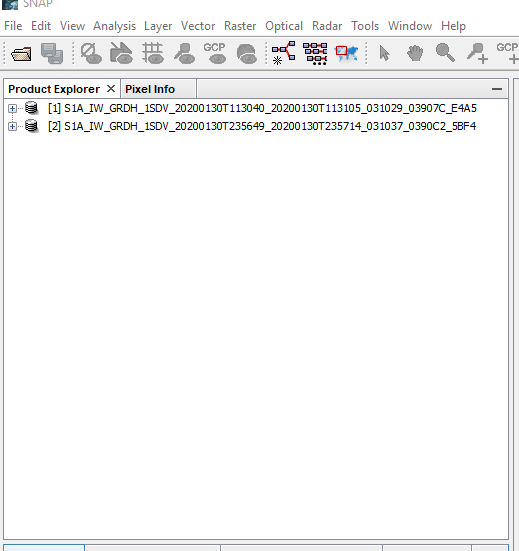
<h4 id="Sección2">Fig 2. Importar imágenes del repositorio.</h4>

<h3>3.2 Aplicación de un recorte (opcional) / Aplicación de un subset</h3>

Las imágenes SAR abarcan grandes áreas, por lo que para disminuir los tiempos de procesamiento se aplicó un recorte sobre el área de estudio.
Use la opción Raster/subset, tome en consideración que este método recorta la vista que se tiene en la interfaz de SNAP (Fig 3).

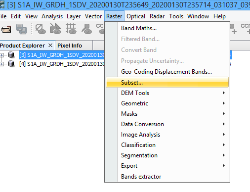
<h4 id="Sección2">Fig 3. Recorte del área de estudio.</h4>

 En Spatial Subset seleccione Geo Coordinates (Fig 4) y coloque los siguientes valores:

<h2>Datos recorte</h2>

<table style="width:100%">
  <tr>
    <th>Bound</th>
    <th>Value</th> 
  </tr>
  <tr>
    <td>North latitude bound</td>
    <td>10.334</td>
  </tr>
  <tr>
    <td>West longitude bound</td>
    <td>-85.573</td>
  </tr>
  <tr>
    <td>South latitude bound</td>
    <td>10.56</td>
  </tr>
  <tr>
    <td>East longitude bound</td>
    <td>-85.401</td>
  </tr>
</table>

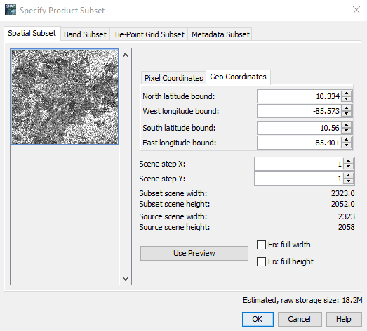
<h4 id="Sección3">Fig 4. Ejecución del recorte del área seleccionada.</h4>

En la pestaña Band Subset el usuario puede recortar la banda de polarización a utilizar (Fig 4), en este caso se mantienen seleccionadas las bandas Amplitude_VV -hace referencia a los valores de amplitud obtenidos en la escena- y Intensity_VV -corresponde a los valores de amplitud al cuadrado- (Le Toan, 2007) (NASA - ARSET (Applied Remote Sensing training), 2017) (Fig 5), ya que con esta polarización se identificara la humedad de suelo (Fig 4).Una vez realizado esto dar click en .

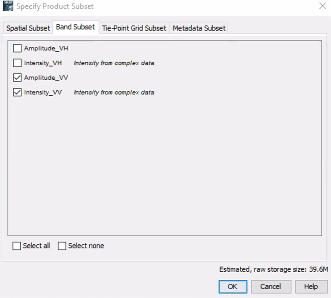
<h4 id="Sección3">Fig 5. Selección de la banda de polarización VV.</h4>

El resultado del recorte corresponde a un archivo temporal, por lo que debe guardarse como una imagen nueva, seleccione el recorte y presione click derecho, use la opción <strong>Save Product As</strong> y elija una ruta de salida (Fig 6). <strong>Este proceso se debe realizar para ambas imágenes.</strong>

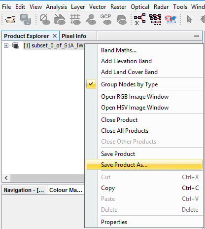
<h4 id="Sección3">Fig 6. Guardado de los recortes de datos.</h4>

<h2 id="Sección4">4. Librería Soil Moisture</h2>

El Soil Moisture and Ocean Salinity (SMOS-SMOS-Box) es una caja de herramientas desarrollada por la Agencia Espacial Europea (ESA) para la observación y análisis de la tierra de forma gratuita en su plataforma de SNAP (European Space Agency (ESA), 2020).

En este caso se analizaron dos imágenes en polarización VV, pero con diferente ángulo de incidencia (Ascendente y descendente). Para preprocesar las imágenes se debe utilizar la herramienta Multi-Angle Pre-Processing, para acceder a esta selecione Radar/Soil Moisture/Pre-Processing/Multi-Angle/Hybrid Pre-Processing.

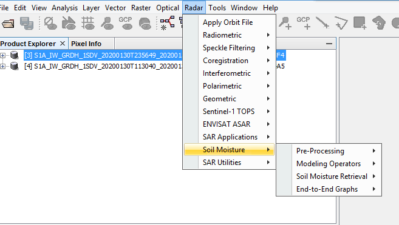
<h4 id="Sección4">Fig 7. Soil Moisture.</h4>

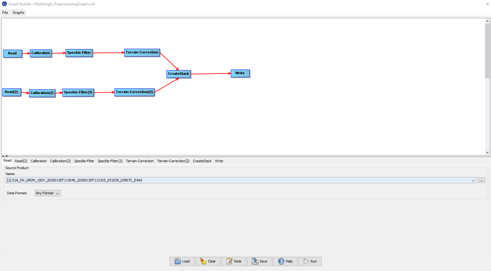
<h4 id="Sección4">Fig 8. Preprocesamiento para imágenes de ángulo múltiple.</h4>

En las opciones <strong>Read (1)</strong> y <strong>Read (2)</strong>, seleccione cada uno de los recorte en Source Parameters.

<h3>4.1 Corrección Radiométrica/Radiometric correction</h3>

Una vez hecho esto, se procede a calibrar radiometricamente la imagen, esto permite asociar el valor de los píxeles de la escena directamente con el reflejo de las microondas de la superficie de la imagen (Environmental Systems Research Institute (ESRI), 2019). Este proceso es indispensable para la ejecución de análisis cuantitativos a partir de imágenes SAR (EO4SD (Earth Observation for Sustainable Development), n.d).

Seleccione la opción <strong>Calibration</strong> y luego indique la polarización VV (Fig 9), repita el proceso en la opción <strong>Calibration (2)</strong>.

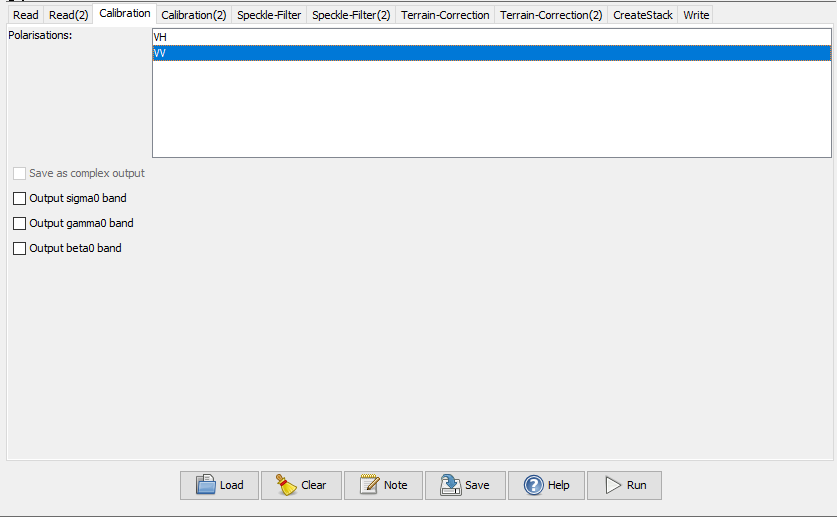
<h4 id="Sección4">Fig 9. Parámetros de corrección radiométrica.</h4>

<h3>4.2 Filtro de moteado / Speckle Filter</h3>

El moteado es una distorsión en las imágenes SAR, que se manifiesta como una estructura granular, conocido como efecto “sal y pimienta”, esta distorsión es inherente en imágenes SAR y es el resultado de la interferencia de los ecos de la retrodispersión (EO4SD (Earth Observation for Sustainable Development), n.d y Flores et al., 2019).

Use la opción <strong>Speckle Filter</strong>. Seleccionar el filtro deseado, en este caso se utilizó <strong>Boxcar</strong> con una ventana de 5x5 (Fig 9) repita el proceso en la opción <strong>Speckle Filter (2).</strong>

  

La selección del filtro de Boxcar se basa en que es uno de los filtros que mejor coherencia muestra en los resultados cuando se trabajan en áreas agrícolas (Minkyo et al., 2017).

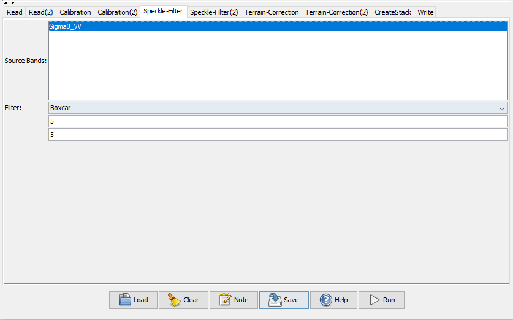
<h4 id="Sección4">Fig 10. Parámetros de filtro de moteado.</h4>

<h3>4.3 Corrección de terreno / Terrain correction</h3>

El objetivo de este proceso es corregir las distorsiones del terreno que se presenten en la escena de la imagen (Flores et al., 2019). El proceso tiene como requisito el uso de un Modelo Digital de Terreno (MDE), se puede utilizar los repositorios de MDE que SNAP proporciona para realizar el proceso.

Use la opción <strong>Terrain-Correction</strong>, dejar las opciones de parámetros por defecto, note que el MDE es seleccionado de forma automática con una resolución de 3 segundos de arco (Fig 11). repita el proceso en la opción <strong>Terrain-Correction (2)</strong>.

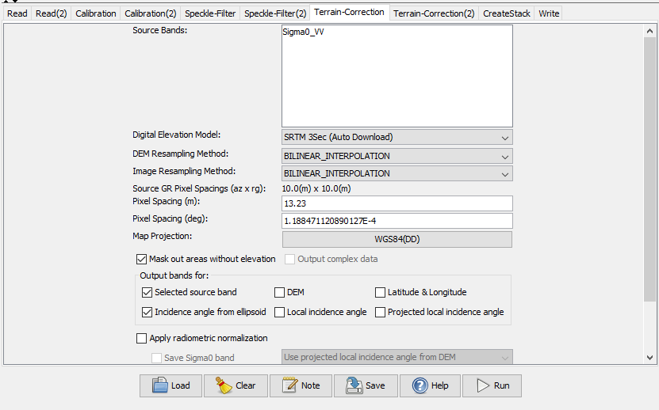
<h4 id="Sección4">Fig 11. Parámetros de corrección de terreno.</h4>

<h3>4.4 Crear un apilado de las imágenes procesadas / Crear un stack de las imágenes procesadas</h3>

Se pretende crear un archivo que compile la información de las imágenes preprocesadas añadidas en las opciones <strong>Read</strong> y <strong>Read (2)</strong>. En la pestaña <strong>Initial Offset Method</strong> seleccione la opción <strong>Product Geolocation</strong>, ya que ambas imágenes han sido debidamente calibradas en órbita, Geométrica y radiométrica en pasos previos (Fig 12).

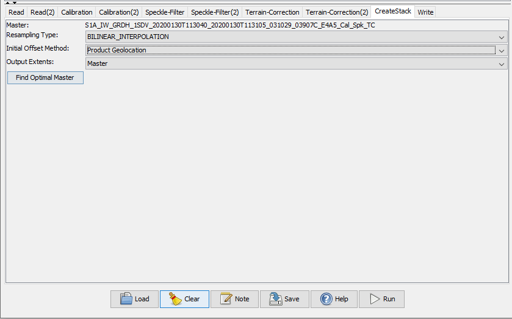
<h4 id="Sección4">Fig 12. Parámetros en la creación del apilado.</h4>

<h3>4.5 Ruta de salida</h3>

Por último en la opción Name establezca un nombre al archivo de salida y en Directory establezca el repositorio de salida (Fig 13).

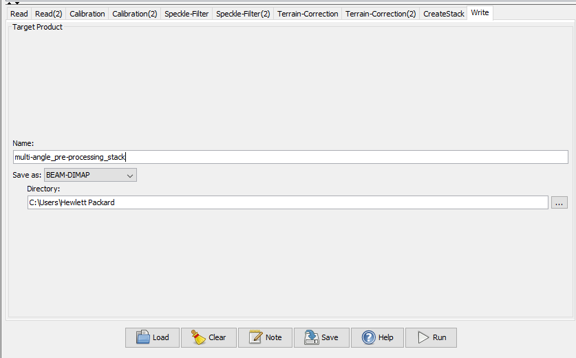
<h4 id="Sección4">Fig 13. Parámetros de ruta de salida.</h4>

Una vez realizado los pasos anteriores dar click en 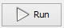. La ejecución de este gráfico de procesos generará un archivo cuyas bandas poseen la imagen maestra Sigma0_VV_mst_30Jan2020 y la imagen esclava Sigma0_VV_slv_30Jan2020. De igual forma, un archivo con información referida al ángulo de incidencia de cada imagen (Fig 14).

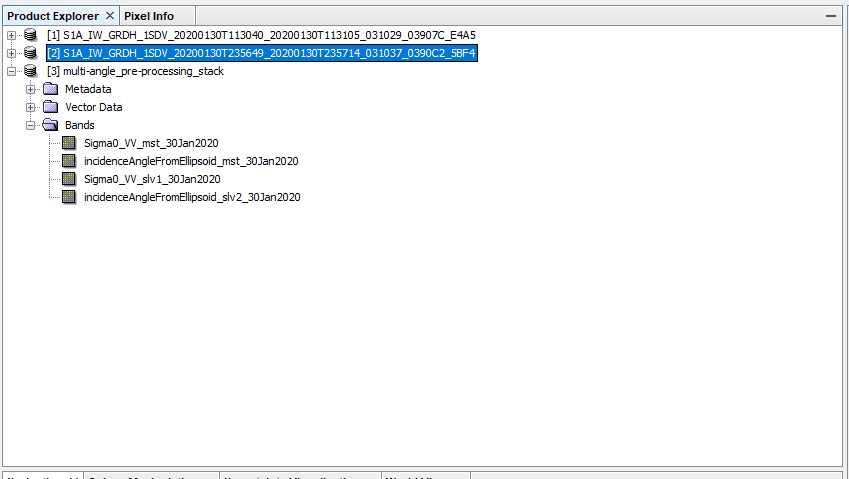
<h4 id="Sección4">Fig 14. Resultados de pre-procesamiento.</h4>

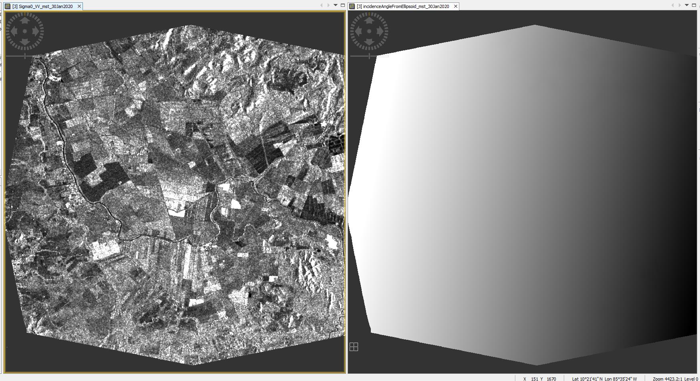
<h4 id="Sección4">Fig 15. Resultados de pre-procesamiento. La imagen de la izquierda corresponde con <strong>Sigma0_VV_mst_30Jan2020</strong>, la imagen derecha presenta valores referidos al ángulo de incidencia correspondiente a la misma imagen.</h4>

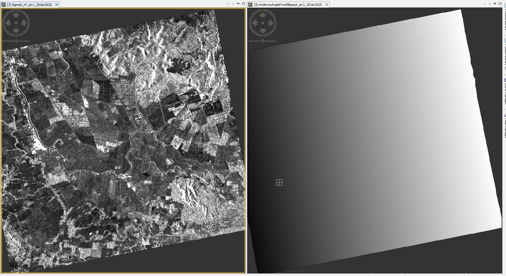
<h4 id="Sección4">Fig 16. Resultados de pre-procesamiento. La imagen de la izquierda corresponde con <strong>Sigma0_VV_slv_30Jan2020</strong>, la imagen derecha presenta valores referidos al ángulo de incidencia correspondiente a la misma imagen.</h4>

<h2 id="Sección5">5. Estimación de humedad de suelo</h2>

Una vez ejecutados los pasos anteriores para ejecutar el cálculo de humedad de suelo se debe acceder a <strong>Radar/Soil Moisture/Soil Moisture Retrieval/Multi-Angle IEM SM Retrieval</strong>

<h4 id="Sección5">Fig 16. Acceso al Multi-Angle IEM SM Retrieval para el cálculo de humedad de suelo.</h4>

Una vez realizado el paso anterior aparecerá el constructor de gráficos de SNAP, el cual ilustra el flujo de procesamiento para el cálculo de humedad de suelo (Fig 17).

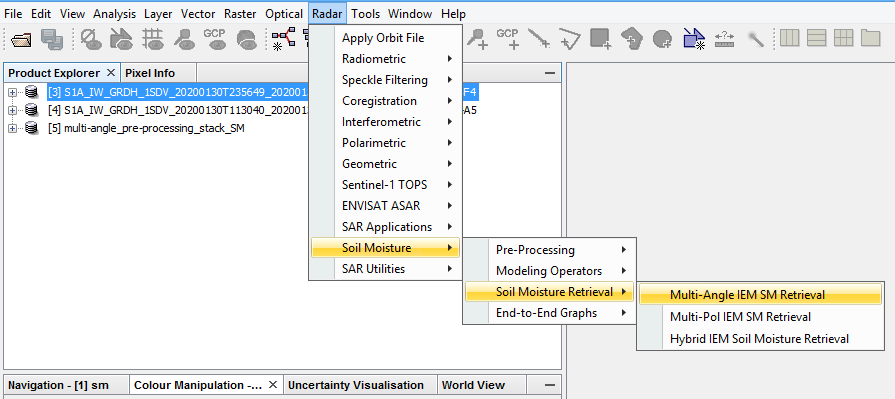
<h4 id="Sección5">Fig 17. Gráfico de procesamiento mostrado por la caja de herramienta de humedad de suelo de SNAP.</h4>

En Read/Name seleccione multi-angle_pre-processing_stack_SM (Fig 18).

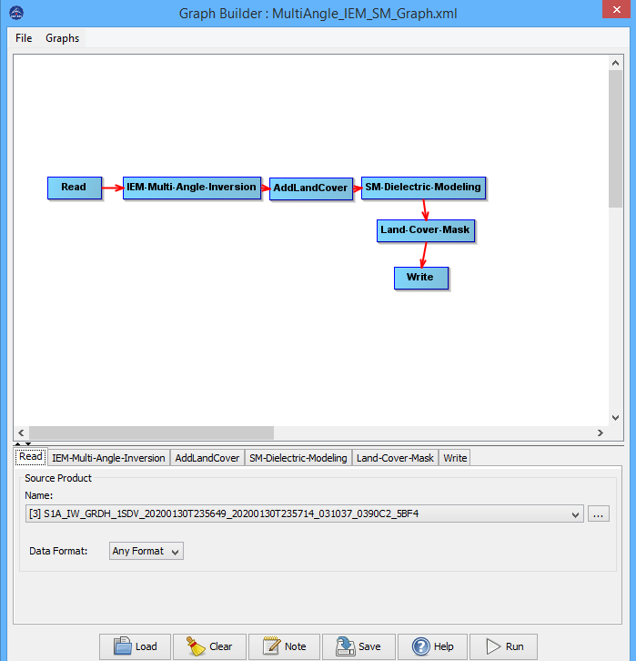
<h4 id="Sección5">Fig 18. Selección del apilado creado producto de los pre-procesos sobre las imágenes de entrada.</h4>

Una vez seleccionado el apilado de imágenes pase a la pestaña <strong>IEM-Multi-Angle-Inversion</strong>, y seleccione las polarizaciones VV1-VV2 en el parámetro de <strong>Polarisation</strong> (Fig 18). Los demás parámetros dejarlos por defecto.

Este proceso tiene como objetivo calcular la constante dieléctrica real (RDC por sus siglas en inglés) en base a los parámetros de las imágenes contenidas dentro del apilado generado previamente.

El enfoque multiángulo utiliza un coeficiente de retrodispersión (HH o VV) de cada una de las dos imágenes (Ascendente-Descendente). En el proceso se puede seleccionar una de las cuatro combinaciones de polarización posibles, en este caso VV.

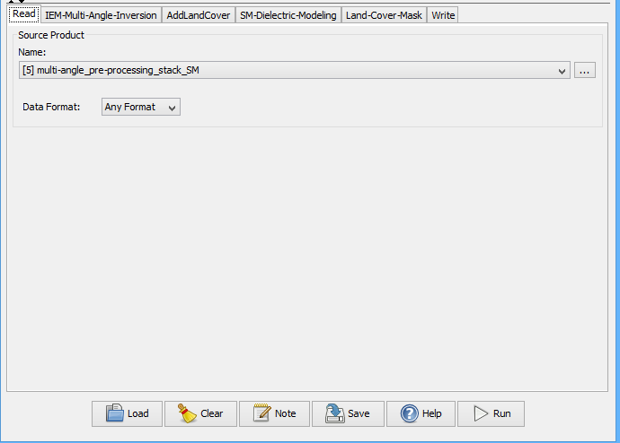
<h4 id="Sección5">Fig 19. Selección de parámetros en IEM-Multi-Angle-Inversion.</h4>

Continuando con el proceso seleccione la pestaña de <strong>AddLandCover</strong>, en este caso seleccione <strong>External Files</strong>, importe los datos de arenas y arcillas descargados de la plataforma SoilGrids, sumado a esto seleccione la opción <strong>CCILandCover-2015</strong> el cual es un mosaico con datos de cobertura perteneciente a la ESA (Fig 20).

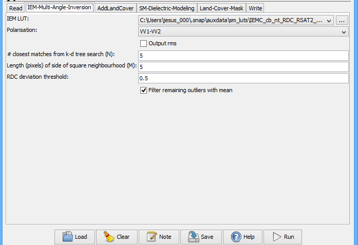
<h4 id="Sección5">Fig 20. Selección de los parámetros en la pestaña <strong>AddLandCover</strong> y añadido de los datos de Arenas(Sand) y Arcillas (Clay) al proceso.</h4>

Una vez calculada la RDC, se procede a utilizar un modelo para invertir la RDC para estimar la humedad de suelo, en este caso el propuesto por Hallikainen -Dielectric Model-, el cual calcula la humedad de suelo a partir de las variables arenas y arcillas en conjunto con los datos de cobertura del CCILandCover-2015 (Fig 21).

En los parámetros de <strong>Min SM</strong> y <strong>Max SM</strong> dejar los valores por defecto.

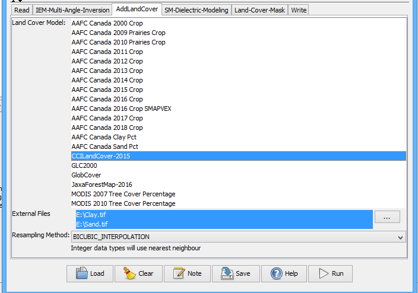
<h4 id="Sección5">Fig 21. Parámetros de la pestaña SM-Dielectric-Modeling.</h4>

En la pestaña <strong>Land-Cover-Mask</strong>, en <strong>Source Bands</strong> seleccione <strong>CCILandCover-2015</strong>, de igual forma en la opción <strong>Land Cover Band</strong>. Por último en <strong>Valid land cover classes</strong>, deje las opciones marcadas por defecto.

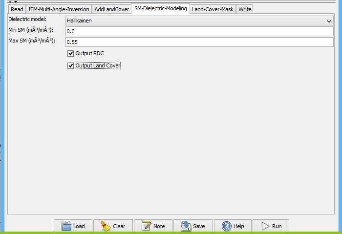
<h4 id="Sección5">Fig 22. Parámetros de la pestaña Land-Cover-Mask.</h4>

Posteriormente en la pestaña <strong>Write</strong>, en <strong>Name</strong> establezca el nombre deseado de salida y en Directory la ruta de guardado del archivo a generar (Fig 23). Y presione.

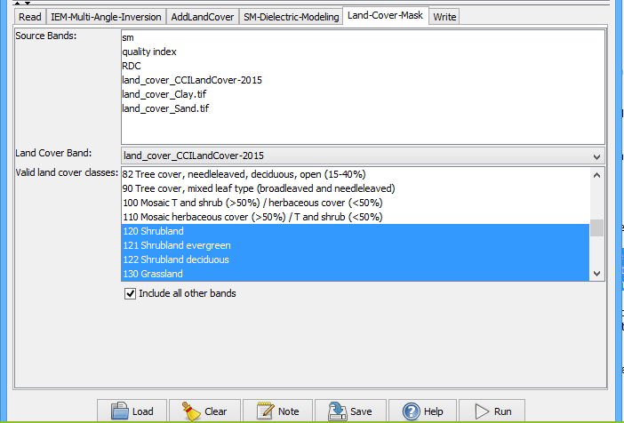
<h4 id="Sección5">Fig 23. Asignación de nombre y directorio de salida del proceso.</h4>

Una vez ejecutado, el nuevo archivo generado posee una serie de bandas (Fig 24), entre las que se encuentra el cálculo de humedad de suelo <strong>(sm)</strong> y el modelo de constante dieléctrica <strong>(RDC)</strong>.

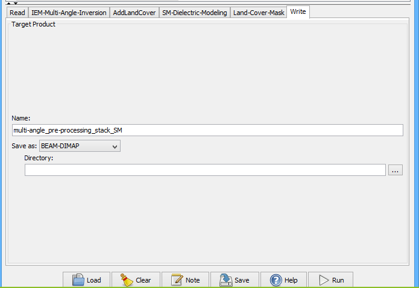
<h4 id="Sección5">Fig 24. Capas raster sm y RDC con el resultado del proceso de cálculo de humedad de suelo.</h4>

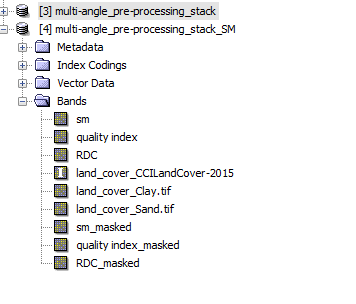
<h4 id="Sección5">Fig 25. Capas raster sm resultado del cálculo de humedad de suelo.</h4>

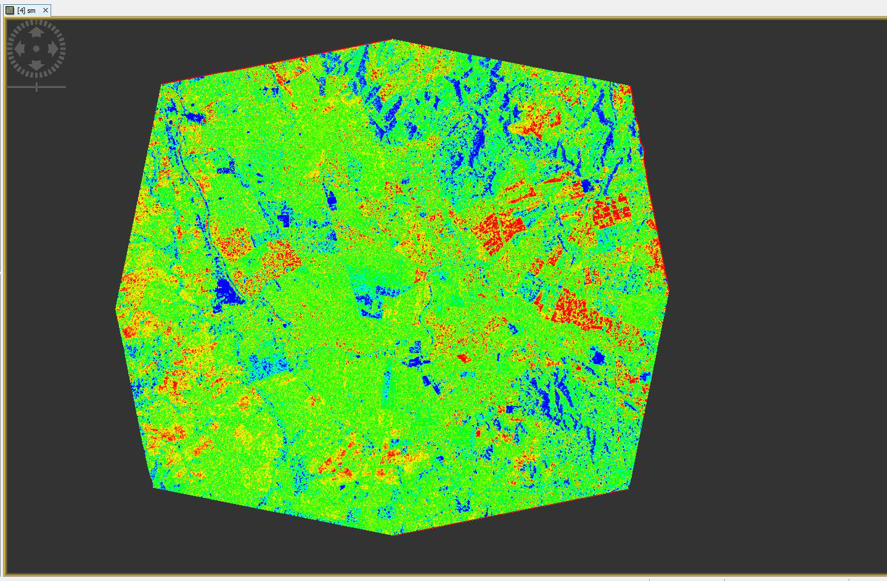
<h4 id="Sección5">Fig 26. Visualización en QGIS del cálculo de humedad de suelo.</h4>

<h2 id="Sección6">6. Recomendaciones</h2>

Para ejecutar este flujo de trabajo debe cerciorarse que en el momento de adquisición de las imágenes no haya presencia de precipitación, ya que el agua en la atmósfera provoca que la señal se disperse, impactando los valores de constante dieléctrica estimados. De igual forma, se debe trabajar con imágenes con la menor distancia temporal posible, en este caso se utilizaron imágenes con una distancia temporal aproximada de 12 horas.

Dado que el coeficiente de retrodispersión se encuentra correlacionado con la humedad de suelo, sectores de alta retrodispersión como el caso de zonas urbanas o de topografía que mire en dirección al sensor suelen detectarse con valores altos de humedad de suelo, por lo tanto se recomienda la aplicación de filtros para descartar estos resultados.

Se recomienda comparar los resultados obtenidos en el flujo de trabajo con datos de humedad de suelo obtenidos en campo para evidenciar la precisión del método y también realizar una calibración de los datos -cálculo de la constante dieléctrica real (RDC)-.

Para más detalles puede ver el siguiente video tutorial, donde se ilustran los pasos para ejecutar lo mostrado en este manual:

<iframe width="420" height="315" src="https://www.youtube.com//embed//WPz0LOWD9oM/"></iframe> 

 

<h2 id="Sección7">7. Bibliografía</h2>

Alexakis, D. D., Mexis, F. D. K., Vozinaki, A. E. K., Daliakopoulos, I. N., & Tsanis, I. K. (2017). Soil moisture content estimation based on Sentinel-1 and auxiliary earth observation products. A hydrological approach. Sensors (Switzerland), 17(6), 1-16. <a href="https://doi.org/10.3390/s17061455" target="_blank">https://doi.org/10.3390/s17061455</a>

Clement, M. A., Kilsby, C. G., & Moore, P. (2017). Multi-temporal synthetic aperture radar flood mapping using change detection. Journal of Flood Risk Management, 11(2), 152-168.<a href="https://doi.org/10.1111/jfr3.12303" target="_blank">https://doi.org/10.1111/jfr3.12303</a>
 

European Space Agency (ESA). (2020). SMOS Toolbox | STEP.<a href="https://step.esa.int/main/toolboxes/smos-toolbox/" target="_blank">https://step.esa.int/main/toolboxes/smos-toolbox/</a>

Environmental Systems Research Institute (ESRI). (2019). Calibración radiométrica de Sentinel-1—Ayuda | ArcGIS Desktop. ArcGIS Desktop.<a href="https://desktop.arcgis.com/es/arcmap/latest/manage-data/raster-and-images/sentinel-1-radiometric-calibration.htm" target="_blank">https://desktop.arcgis.com/es/arcmap/latest/manage-data/raster-and-images/sentinel-1-radiometric-calibration.htm</a>

Flores-Anderson, A. I., Herndon, K. E., Bahadur Thapa, R., & Cherrington, E. (Eds.). (2019). The Synthetic Aperture Radar (SAR) Handbook: Comprehensive Methodologies for Forest Monitoring and Biomass Estimation. <a href="https://doi.org/10.25966/nr2c-s697" target="_blank">https://doi.org/10.25966/nr2c-s697</a>

ISRIC. (2020). Soil Grids.<a href="https://soilgrids.org/" target="_blank">https://soilgrids.org/</a>

Le Toan, T. (2007). Introduction to SAR Remote Sensing Lecture.<a href="https://earth.esa.int/landtraining07/D1LA1-LeToan.pdf" target="_blank">https://earth.esa.int/landtraining07/D1LA1-LeToan.pdf</a>

Minkyo, Y., Yun, H., Kim, H., Lee, W., & Kim, K. (2017). A Study on Optimal D-InSAR Filtering Technique According to Landform Relief. Proceedings, 1(8), 723.<a href="https://doi.org/10.3390/proceedings1080723" target="_blank">https://doi.org/10.3390/proceedings1080723</a>

NASA - ARSET (Applied Remote Sensing training). (2017). NASA Remote Sensing for Flood Monitoring and Management Accessing SAR Data Objectives.<a href="https://arset.gsfc.nasa.gov/sites/default/files/disasters/Dewberry/S2E4.pdf" target="_blank">https://arset.gsfc.nasa.gov/sites/default/files/disasters/Dewberry/S2E4.pdf</a>

Shen, W., Li, M., Huang, C., Tao, X., Li, S., & Wei, A. (2019). Mapping annual forest change due to afforestation in Guangdong Province of China using active and passive remote sensing data. Remote Sensing, 11(5), 1-21. <a href="https://doi.org/10.3390/rs11050490" target="_blank">https://doi.org/10.3390/rs11050490</a>

Tsyganskaya, V., Martinis, S., Marzahn, P., & Ludwig, R. (2018a). Detection of temporary flooded vegetation using Sentinel-1 time series data. Remote Sensing, 10(8).<a href="https://doi.org/10.3390/rs10081286" target="_blank">https://doi.org/10.3390/rs10081286</a>

Tsyganskaya, V., Martinis, S., Marzahn, P., & Ludwig, R. (2018b). SAR-based detection of flooded vegetation–a review of characteristics and approaches. En International Journal of Remote Sensing (Vol. 39, Número 8, pp. 2255-2293). Taylor and Francis Ltd. <a href="https://doi.org/10.1080/01431161.2017.1420938" target="_blank">https://doi.org/10.1080/01431161.2017.1420938</a>

